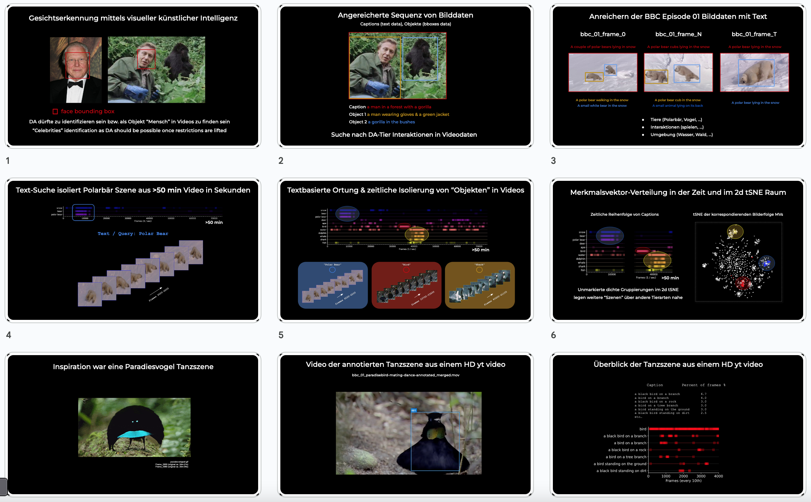

# darc

Welcome to darc.ai, the AI branch of the non-profit David Attenborough Research Consortium (DARC). We love DA and aim to make his work even more accessible. Therefore, we aim to enrich DAs work using modern deep learning and generative AI methods. We will experiment with long-format video understanding, semantic search (in a knowledge base about DA) and translations of his classic "Life on Earth (1979)" into german that capture DAs unique style of presenting.

NOW MAKE THE FIGURE

the Figure 1 shows the number of major programs DA created across 6 decades (n=147, source:wiki DA filmograhpy page). Most often he was credited as writer and presenter (47/147), followed by narrator (n=31), presenter (n=22) and narrator and presenter (n=16). The right hand y-axis shows the total video duration of the 5 programs (n=46 videos) we've selected for our initial investigation. Our video source is the Wildlife Documentaries Collection on internet-archive.org. The total viewing duration of the n=341 .mp4 video files is >240 hours (plus 22 hours of audio recordings such as audiobooks, interviews etc.). The five programs we've selected amount to XX hours of video material (X% of the total video material on internet-archive.org).

A superficial string matching identifed ""X of Y being in programs""

- People of Paradise

David Attenborough Research Commendation / Consortium/ Club

BBC_01 > show the animals but DA not present

Investigatiing few Example image frames extracted from the video episode "Life In The Trees", episode 12, season 01 from the classic Series "Life on Earth" LoE (1979). suggested DA can be detected and investigated too...

https://docs.google.com/presentation/d/17C95yKc8hNRXZ2Ghl6CfUvUfJpss05Vb-dKWZSWgNj0/edit?usp=sharing

# 1. bbc _ earth ep1-12? and azure: presentation

## Something

# 2. meanwhile internet archive > LoE (1979)

not translated nor voice-synchronized into german. We will attempt to produce a reasonable quality voice-sync / T2S of LoE, some name it the best... evolutinary history etc.

# 3. Next steps > collect and cut toegether frames where DA comes up for the gorilla episode. this enables manioursims of your DA etc.

---

Freely available "Planet Earth" video dataset with english (and italian) audio and subtitles:

BBC Planet Earth Dataset for Scene Detection

This dataset features eleven episodes from the BBC Educational TV series Planet Earth ()http://imagelab.ing.unimore.it)

Process outline

- frame extraction
- frame captioning > text caption (searable using text)
- frame feature extraction > tSNE population (using transformer for feat. ext.)
- zoom into bird scene temporal marked > then "semi-supervised" ie mark animals and extract significant counts of an animal within captions

USEFUL APPLICATIONS (add to outline))

**finding david attenborough (try with wildlife and with imdb photo of him)**

searching video files for specific content

**feature vector == content vector**

---

- Data we are going to use
  - subtitle transcript text data (narrated by DA)) for rough word cloud based localisation of content
  - azure text caption per frame > image-level labeling > should be more reliable than narrater
  - cross reference with extracted features and so on.

Download the dataset directly from source or use the provided git-lfs files located in a folder "./videos".

videos/bbc_01.mp4 denotes the first episode of the show (11 episodes in total?).

Started to crap every 5th frame and save the image under bbc_01_embeddings/images/frame_{frame_counter}.jpg (using clip-video-encode)

bbc_01-from-srt.txt denotes the transciption of the english subtitle extracted from the english .srt file (bbc_01.srt))

bbc_01-text-captioning-frames-azure.json denotes the image frame text captioning (used see code Azure))

(video summary? > summary based on the subtitle or the captioning?)

Summary

- video and images of every 5th frame
- feature vectors (clip-video-encode) > CAN be re-done using vit
- visualize FV
- captions using azure! > vis, bird, smooth, annotators indices useful, ie to define the chapters and label them for indexing? word-cloud-per chapter etc.
- search captions vs. subtitle text vs. image to identify ""paradies bird chaper""
- get the time or frame where the text belongs to and use binning to make a word cloud
- 

bbc_01.wav - english audio

bbc_01-text-captioning-frames-azure_25th-frame.json

und

bbc_01-text-captioning-frames-azure_5th-frame.json solllte auch existieren

A hundred years ago there were one and a half billion people on earth . But even so, there are still places barely touched by humanity . This series will take you to the last Wildernesses and show you the planet's wildlife as you have never seen them before .
