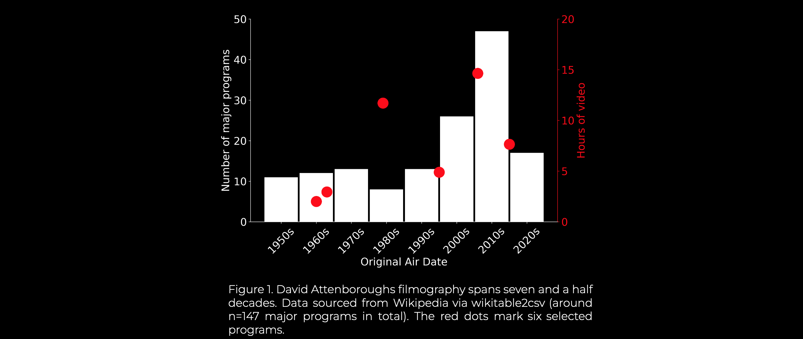
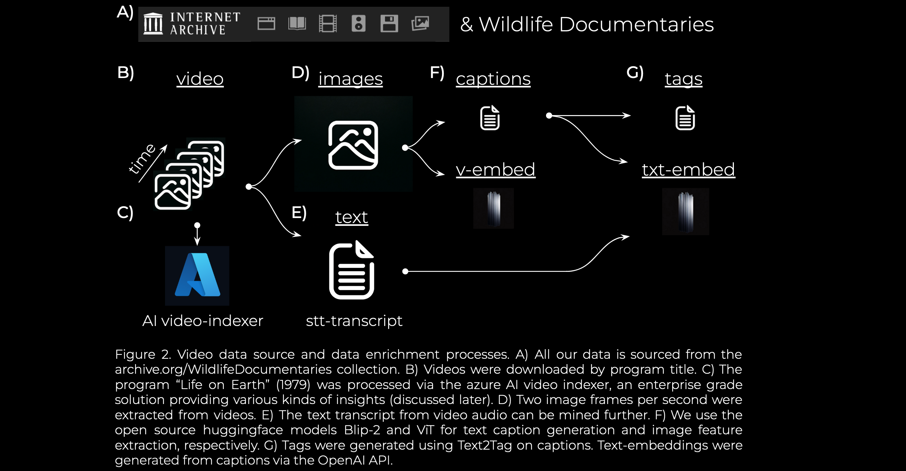
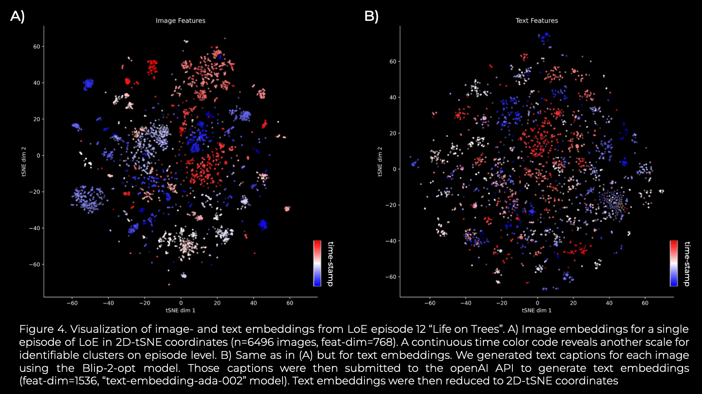

# darc.ai

Welcome to darc.ai, the AI branch of the non-profit David Attenborough Research Consortium (DARC). We simply love David Attenborough (DA)! And therefore we aim to enrich his fantastic work using modern deep learning, generative artificial intelligence (AI) methods and most recent assistants like ChatGPT. Those results, together with extracted and time stamped image frames ("frame_00000_hh-mm-ss.msmsms.jpg", ...) from videos constitutes the [darcai-life-on-earth](https://huggingface.co/datasets/mikehemberger/darcai-life-on-earth) dataset (freely available as a [huggingface dataset](https://huggingface.co/datasets/mikehemberger/darcai-life-on-earth/viewer/default/train)!).

As a first enrichment, we include text captions generated by the huggingface "Salesforce/blip2-opt-2.7b" model for >84K image frames. Furthermore, [image embeddings](./data/video_image_embeddings_google_vit_base.npy) ("google/vit-base-patch16-224-in21k", dim=768) and [caption-txt embeddings](./data/caption_text_embeddings_openai_ada_002.npy) (using openAIs "text-embedding-ada-002" model, dim=1536) are available here for all >84K images. Those are numpy arrays and stored on github via git LFS.

**This is important (you need to install git lfs before cloning the repo, this ensures that embeddings are loaded correctly):**

```
git lfs install
```

We hope the machine learning and AI community enjoys-, plays with- and shares their findings about this dataset.

Here, we will share our initial investigations into documentary - format video enrichment. We hope to explore novel ways to gain insights into video data and advance the cause of AI-enabled video understanding for the benefit of humanity.

Our first contribution is to address the partial inaccessibility of David Attenboroughs narration for non-english speakers. Over the course of our research on DAs work we were surprised to note that his 1979 classic "Life on Earth" (LoE) program was impossible to find as translation into our native tongue: german. To start and overcome this shortcoming, we will provide the JSON output from Azure AI Video Indexer for the entire LoE program in (native) english and AI-translated german (soon to be released). Text transcripts from the video audio channels will become available then. We believe that the output data "insights" from an enterprise grade solution will provide a decent baseline to benchmark open-source video understanding approaches.

## 1. David Attenboroughs immense productivity over decades

Figure 1 shows the number of major programs DA created across seven and a half decades (n=147, [csv-file](./data/da_filmography_from_wiki.csv), source: https://en.wikipedia.org/wiki/David_Attenborough_filmography). Most often he was credited as writer and presenter (47/147), followed by narrator (n=31), presenter (n=22) and narrator and presenter (n=16) (data not shown). The right hand y-axis (red color) shows the total video duration of the six programs (n=46 videos) we've selected for our initial investigation.



## 2. Video source and enrichment

Figure 2 illustrates our video data source and enrichments generated. Our video source is the [Wildlife Documentaries Collection on archive.org](https://archive.org/download/WildlifeDocumentaries). It is a "David Attenborough Archive" in disguise. The total viewing duration of n=341 MP4 video files was estimated close to 243 hours. Furthermore, 22 hours of audio recordings such as audiobooks, interviews and more is available there. We collected the scraped list of all the video- and audio data with durations in this [csv-file](./data/darc-iarchive-wldoc-with-vid-durations.csv).



The six programs we've selected amount to 44 hours of video material (roughly 18% of the total video material contained in our source at the archive.org collection) and span from the 60s to the 2020s:

- *1960 - The People of Paradise*
- *1963 - Quest Under Capricorn*
- *1979 - Life on Earth* **(dataset available at [huggingface datasets hub](https://huggingface.co/datasets/mikehemberger/darcai-life-on-earth))**
- *1995 - The Private Life of Plants*
- *2006 - Planet Earth*
- *2015 - The Hunt*

## 3. Visual representations for the entire program "Life on Earth"

Figure 3 shows the image-embeddings for the entire program "Life on Earth" (1979). Video-image-frames were resized to 224x224 pixels and feature extraction was performed on the images using the Vision Transformer (ViT) model from Hugging Face Transformers ("google/vit-base-patch16-224-in21k", see above). Then image-embeddings were subjected to t-Distributed Stochastic Neighbor Embedding (t-SNE) to identify visually coherent groupings. While time is implicitly retained as an axis (as a color code here), it is replaced with a 2D t-SNE representation to better visualize the content of image-based feature vectors (Figure 3).


For detailed investigations we recommmend viewing the figure as image file with all its details ([original-image](./readme-examples/image-embeddings-tsne-time-labeled-ep-12-highlighted_.jpg)).

We have attempted to visualize image-embeddings of multiple programs but that yielded unclear results (not shown). But visualizations on the program level appear to be informative (Figure 3 and Figure 4). The grouping of points in tSNE indicates a semantic layout that could bring image-based and text-based embeddings together. For example, the clear groupings with relatively uniform colors suggest that the captions text correlates well with the image embeddings over time ([Figure 4A](./readme-examples/image-embeddings-tsne-time-color-code_.jpg) and [Figure 4B](./readme-examples/text-embeddings-tsne-time-color-code_.jpg)).

## 4. Image- and Text Embeddings for a single episode from LoE: "Life in Trees"



## 5. Notebook and Python Files

We provide [python scripts](./scripts/) to download videos from archive.org to your local machine and essentially go step-by-step through the ETL video pipeline in the jupyter notebook [darc-pipeline.ipynb](./darc-pipeline.ipynb). All our processing steps can be reproduced from there.
